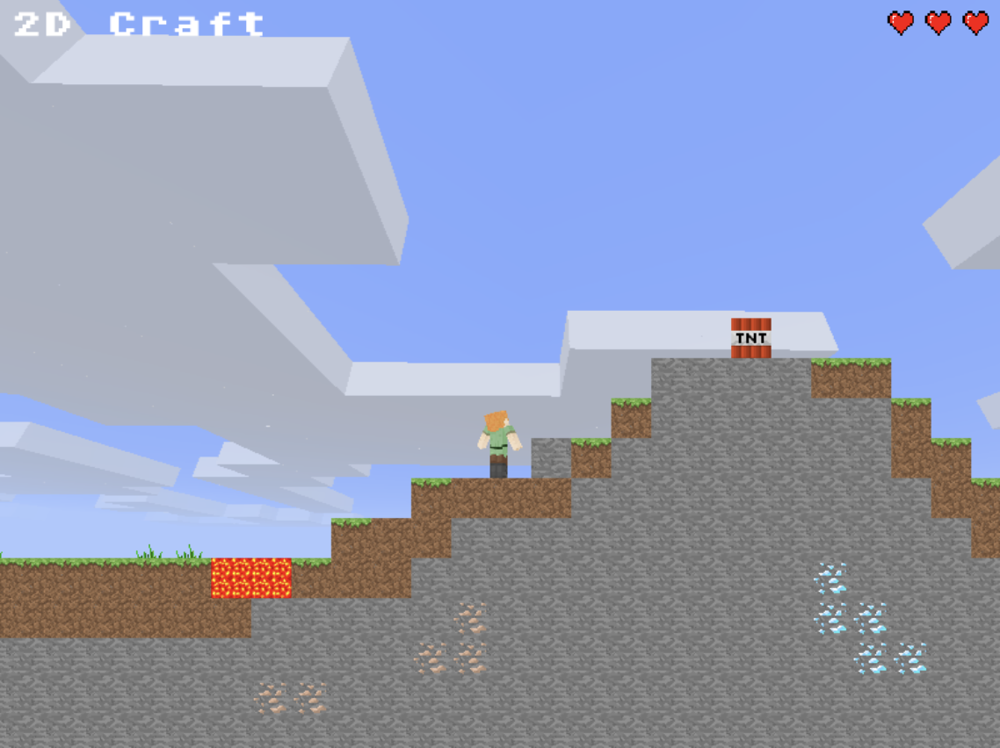

# 2D Craft

A 2D side-scrolling game that mimics gameplay of Minecraft. Implemented with [Phaser 3](https://phaser.io/phaser3).

Check the [DEMO](https://albertcsm.github.io/2dcraft/).

## Goal

Collect the treasure at the end of the stage. Watch out for the lava and TNTs while you move.

## Controls

<kbd>A</kbd> / <kbd>D</kbd>: Left, Right

<kbd>W</kbd> / <kbd>S</kbd>: Look upwards / downwards when placing/breaking a block

<kbd>Space</kbd>: Jump

<kbd>,</kbd>: Place a block

<kbd>.</kbd>: Break a block
